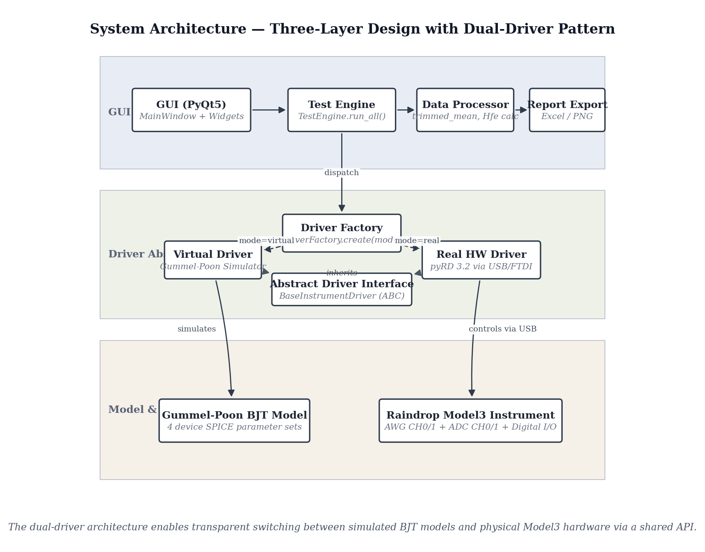
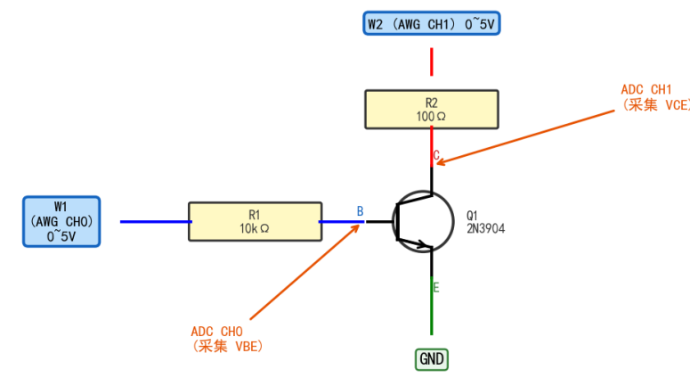
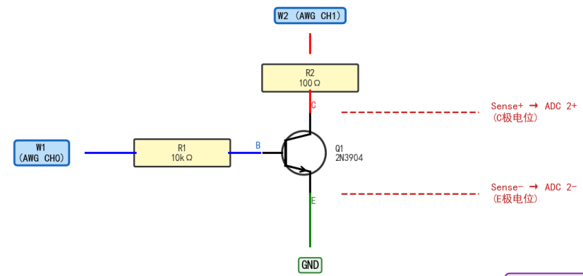
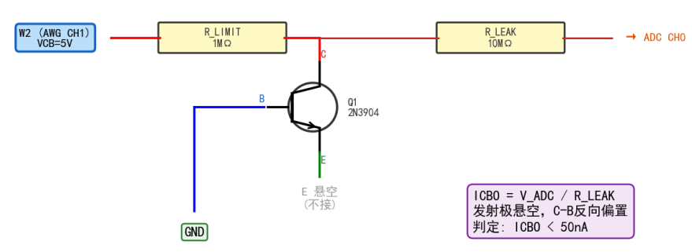

# BJT Automated Testing & Domestic Substitution Verification System

[](LICENSE)
[]()

An automated BJT transistor testing system built on the **Raindrop Model3 instrument-on-chip platform**, supporting dual-mode operation (virtual Gummel-Poon simulation and real hardware), measuring **6 DC parameters** and **6 characteristic curves** per device. Designed for domestic-vs-import semiconductor substitution analysis.

## System Architecture



The three-layer design with a **dual-driver pattern** enables transparent switching between simulated BJT models and physical Model3 hardware through a shared Python API.

## Key Features

- **6 DC Parameters**: hFE (current gain), VCE(sat), VBE(sat), ICBO, ICEO, BVCEO
- **6 Characteristic Curves**: IC-VCE family, hFE-IC, VBE(sat)-IC, VCE(sat)-IC, IC-VBE (transfer), VCE-IB
- **Dual-Mode Operation**: Virtual simulation (Gummel-Poon SPICE model) ↔ Real hardware (Model3 platform)
- **Signal Processing Pipeline**: 2048-point buffer → trimmed mean (5%) → 3σ outlier removal → Savitzky-Golay filter
- **Factory + Strategy Design Pattern**: Clean driver abstraction for extensibility
- **PyQt5 GUI**: Single-window interface with real-time curve plotting
- **One-Click Testing**: Full automated run in approximately 5 minutes per device

## Test Circuits

### hFE Measurement Circuit


### Saturation Voltage Circuit (Kelvin 4-Wire)


### Leakage Current Circuit (Transimpedance)


Three dedicated measurement circuits on a single breadboard:

| Test | Method | Key Parameters |
|------|--------|----------------|
| hFE | Forced IB, sensed IC via RSENSE | RB = 1kΩ, RSENSE = 100Ω |
| VCE(sat) / VBE(sat) | Kelvin 4-wire force/sense | Eliminates wiring resistance error |
| ICBO / ICEO | Transimpedance amplifier | RLEAK = 10MΩ, 1mV = 100pA resolution |

## Quick Start

### Prerequisites

- Python 3.10+
- Model3 hardware (for real-hardware mode; virtual mode runs without hardware)
- IP-SDK 3.2 (pyRD library) from Raindrop Technology

### Installation

```bash
git clone https://github.com/TitianMu/BJT-Test-System.git
cd BJT-Test-System
pip install -r bjt_tester/requirements.txt
```

### Usage

```bash
cd bjt_tester
python gui_main.py
```

The GUI provides:
1. **Virtual Mode**: Select a device preset → run 6-parameter tests → generate datasheet curves
2. **Real Hardware Mode**: Connect Model3 → auto-detect device → run measurements

### IP-SDK Setup

The `RealInstrumentDriver` requires the **pyRD** library from the IP-SDK (version 3.2), which is proprietary software by Raindrop Technology. To enable real-hardware mode:

1. Obtain IP-SDK 3.2 from Raindrop Technology
2. Place the SDK folder in the project root
3. The driver automatically imports `pyRD` when hardware mode is selected

Virtual mode works without the SDK — all tests run against the Gummel-Poon BJT model.

## Project Structure

```
BJT-Test-System/
├── bjt_tester/               # Core Python source
│   ├── gui_main.py           # PyQt5 GUI application
│   ├── test_engine.py        # Test orchestration engine
│   ├── real_driver.py        # Model3 hardware driver (pyRD 3.2)
│   ├── virtual_driver.py     # Gummel-Poon simulation driver
│   ├── driver_factory.py     # Factory pattern for driver selection
│   ├── driver_base.py        # Abstract driver interface (ABC)
│   ├── bjt_model.py          # SPICE parameter sets (4 devices)
│   ├── datasheet_curves.py   # 6-characteristic curve generation
│   ├── data_processor.py     # Statistical signal processing
│   ├── report_generator.py   # Excel/PNG export
│   ├── debug_vcesat.py       # VCE(sat) debug utilities
│   ├── bjt_tests.py          # Low-level test functions
│   ├── user_presets.json     # User-defined device presets
│   ├── requirements.txt      # Python dependencies
│   └── 环境搭建指南.txt       # Setup guide (Chinese)
├── docs/
│   ├── Technical_Report.pdf  # Full technical report
│   ├── Technical_Report.docx # Editable report
│   └── Test_Results.pdf      # Measurement results collection
├── simulation/               # Multisim circuit files
│   ├── 放大倍数测试电路.ms14   # hFE test circuit
│   ├── 饱和压降测试电路.ms14   # VCE(sat) test circuit
│   ├── 漏电流检测.ms14        # Leakage current detection
│   ├── 频率特性电路.ms14       # Frequency response
│   └── 反向耐压高压部分.ms14   # Reverse breakdown
├── hardware/                 # Hardware photos
│   ├── model3_platform.jpg   # Raindrop Model3
│   └── breadboard_circuit.jpg # Breadboard implementation
├── assets/                   # Diagrams & screenshots
│   ├── system_architecture.png
│   ├── BJT_Test_System_Flowchart.svg
│   ├── 放大倍数电路.png         # hFE circuit
│   ├── 饱和压降电路.png         # Saturation circuit
│   ├── 漏电流电路.png           # Leakage circuit
│   ├── gui_main_window.png
│   ├── gui_dual_mode.png
│   └── gui_virtual_presets.png
├── .gitignore
├── LICENSE                   # MIT
└── README.md
```

## Video Demonstrations

| Video | Link |
|-------|------|
| Hardware Function Demo | [Bilibili](https://www.bilibili.com/video/BV1m2E96LE5x) |
| Project Presentation | [Bilibili](https://www.bilibili.com/video/BV1D6E96JE6E) |
| Virtual Environment Setup Tutorial | [Bilibili](https://www.bilibili.com/video/BV1D6E96JELV) |
| GUI Software Demo | [Bilibili](https://www.bilibili.com/video/BV1g6E96nEy5) |

## Tested Devices

| Device | Manufacturer | Type | Role |
|--------|-------------|------|------|
| LGE-2N3904 | Luguang (鲁光) | NPN | Domestic candidate |
| ON-2N3904 | ON Semiconductor | NPN | Import benchmark |
| JSCJ-BC337 | JS Changjing (江苏长晶) | NPN | Domestic candidate |
| ON-BC337 | ON Semiconductor | NPN | Import benchmark |

## Dependencies

- **Python**: 3.10+
- **GUI**: PyQt5
- **Scientific**: numpy, scipy, matplotlib
- **Export**: openpyxl
- **Hardware SDK**: pyRD 3.2 (proprietary, for real-hardware mode only)

## License

This project is licensed under the MIT License — see the [LICENSE](LICENSE) file for details.

The IP-SDK (pyRD) is proprietary software by Raindrop Technology and is **not** included in this repository.
